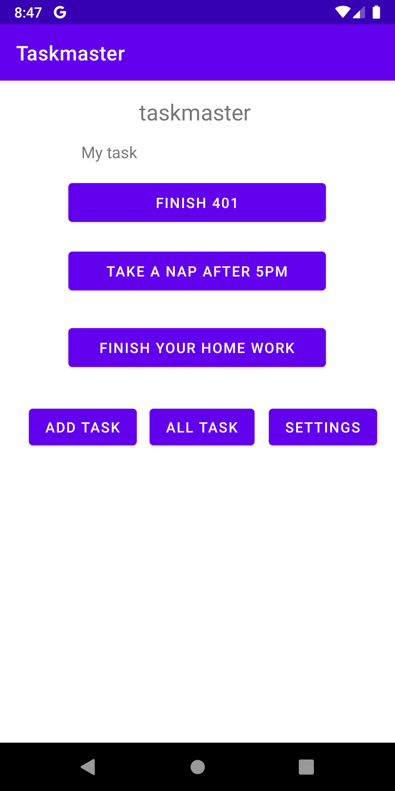
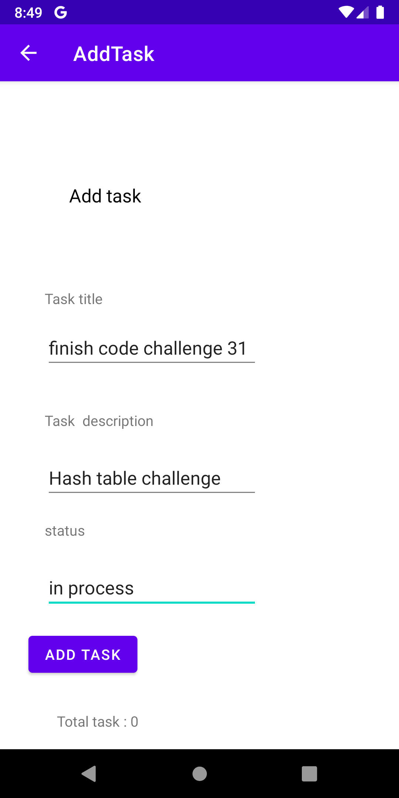
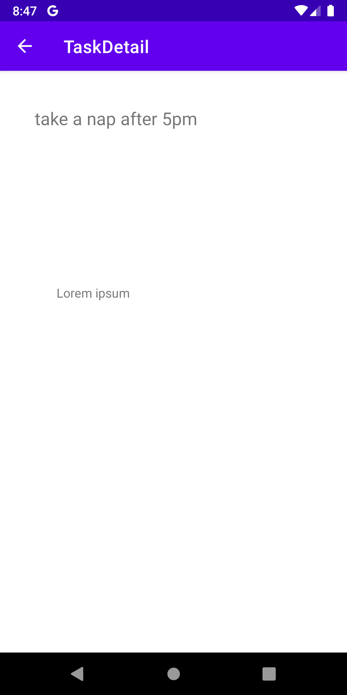
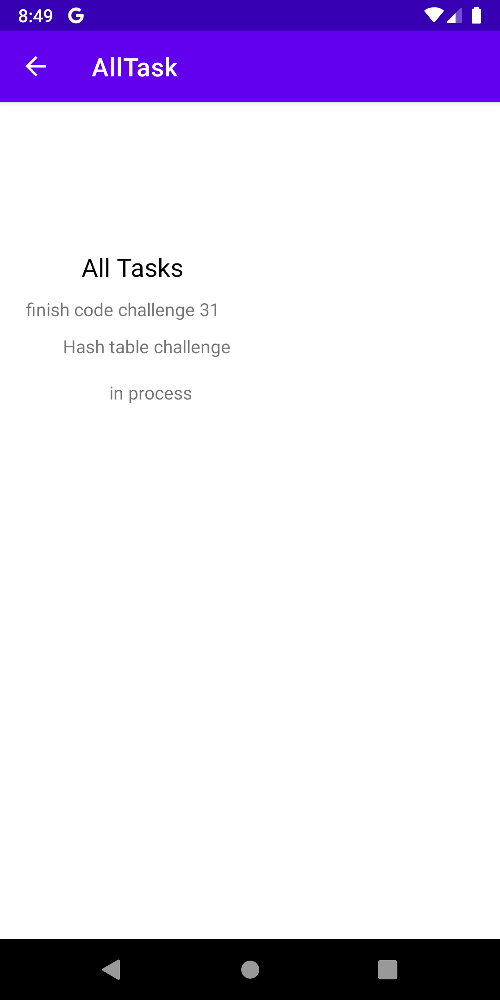
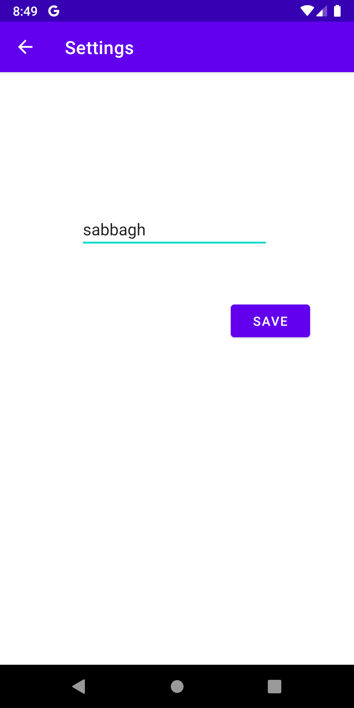

# taskmaster

## lab 26 
### What we did today is know how to deal with multi activities and know how we can move between each layout using buttons and crating functions.

## lab 27 
### In today lab we start dealing with sending values between pages and using  SharedPreferences to save values into it. 
### And here is the home page and the task page for our application 

## lab 28

### Today we learned how to use recycler view  by creating adapter class and fragment and know how to implement it
### it's very good thing to use because  it will help you to save time for creating new class for each new page 

## lab 29 
### For today we start using Room in our application and you need to know how to use it because it's necessary  thing to use in your application so what we did is save data into database and show it in other page after we get it from the database

## lab 31
### Today we start using Espresso testing to test our application there to many type of testing what we acutely used is sending the id for a view and and check if this id working well by check if we can click on it if it a button or if we can write a text if it a form

#### This is the home page we can see the tasks and you can move from it to the other pages using the showed buttons

## lab 32

### what I did today is start using  AWS amplify to deal with database and models, so insted of using room for saving data on it we replace it with AWS amplify to save data and show it in the all task page .

#### In this page we can add tasks by filling the form as shown. 

#### This page will contain the detail for a specific task.

#### Here you can see all tasks that you add it in the add task page and you can move between tasks by scrolling to the left

#### in the setting page you can add you user name and it will appear in the home page 

