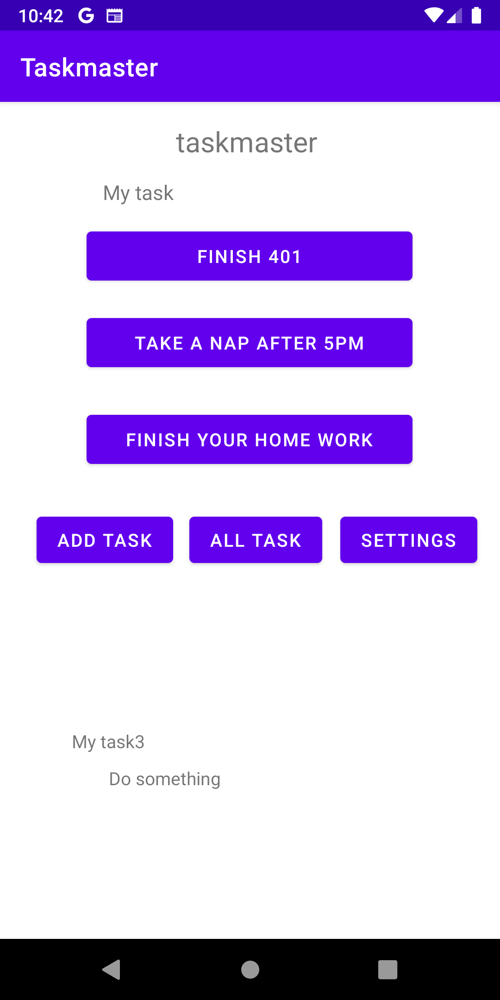

# taskmaster

## lab 26 
### What we did today is know how to deal with multi activities and know how we can move between each layout using buttons and crating functions.

## lab 27 
### In today lab we start dealing with sending values between pages and using  SharedPreferences to save values into it. 
### And here is the home page and the task page for our application 

## lab 28

## Today we learned how to use recycler view  by creating adapter class and fragment and know how to implement it
## it's very good thing to use because  it will help you to save time for creating new class for each new page 

