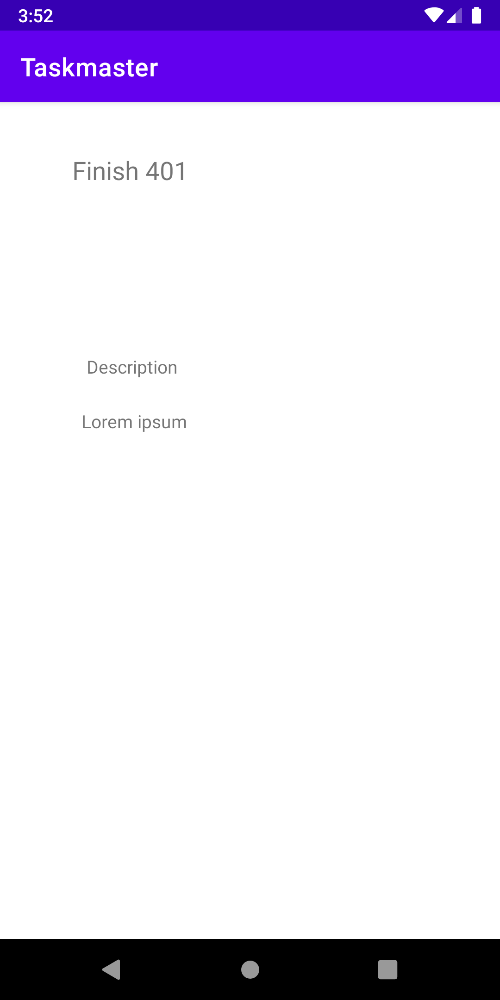

# taskmaster

## lab 26 
### What we did today is know how to deal with multi activities and know how we can move between each layout using buttons and crating functions.

## lab 27 
### In today lab we start dealing with sending values between pages and using  SharedPreferences to save values into it. 
### And here is the home page and the task page for our application 

